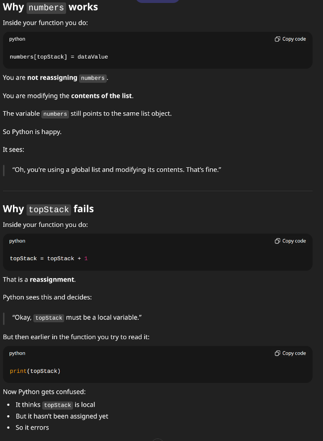

## A Level Computer Science H446/01 paper J June 2024

**Contents**

1. [Stack Push](#stack-push)
2. [Denary to Octal Conversion](#denary-to-octal-conversion)
3. [Stack Push (success/fail)](#stack-push-successfail)


---

### Stack Push

 The contents of a stack are stored in the 1-dimensional array called `numbers`. `topStack` stores the index of the next free space in the stack.
 
 The array is declared with space for 100 elements.

 **Question (a)**
 
 The function `pop()` returns the next item from the stack and updates the appropriate pointers.

 Describe the steps in the function pop().

***Answer:***

1. Declares a variable to store the `result` to be returned.
2. Look up the item from `numbers` at the index location of `topStack`and store it in `result`.
3. If `topStack` doesn't equal 100 increment `topStack` by +1, else set to 0.
4. Return the `result`.

---

**Question (b)**

The function `push()` inserts its parameter called dataValue onto the stack and updates the appropriate pointers.

Complete the function push() using pseudocode or program code.

```python
# Replace the ..... sections

def push(dataValue):
 if topStack != 100:
    numbers[topStack] = dataValue
    topStack = topStack + 1
    return True
 else:
    return False
```

```pseudo
function push(.....)
    if ..... != 100 then
        numbers[.....] = dataValue
        topStack = topStack + .....
        return true
    else
        return false
    endif
endfunction
```

---

**Question (c)**

Write an algorithm, using pseudocode or program code, to call the function push() with the value 15 and output a message saying **"Added"** if the value was successfully inserted onto the stack or **"Not Added"** if the stack is full.

```python
# Continue from the edited function above

def push(.....)
 if ..... != 100:
    numbers[.....] = dataValue
    topStack = topStack + .....
    return true
 else
    return false
```

[back to top](#a-level-computer-science-h44601-paper-j-june-2024)

---

### Denary to Octal Conversion

Octal is a base 8 number system.

To convert a denary number to base 8:
- the denary value is divided by 8 and the remainder is stored
- the integer value after division is divided by 8 repeatedly until 0 is reached
- the remainders are then displayed in reverse order.

**Example 1:**

    Denary 38
    38 / 8 = 4 remainder 6 6
    4 / 8 = 0 remainder 4 4
    Octal = 46

**Example 2:**

    Denary 57
    57 / 8 = 7 remainder 1 1
    7 / 8 = 0 remainder 7 7
    Octal = 71

Write an algorithm to:

1. take a denary value as input from the user
2. convert the number to octal
3. output the octal value.

*Note:* You do not need to validate the input from the user.

Write your algorithm using pseudocode or program code.

```python
# Pythonic way to be able to standalone test the expected behavior of the logic:
def den_convert(den_num):
    # Because we are using a loop to add the results to one by one we're defining result as an empty string initially (we need to use string to put the numbers next to each other, we cannot do this with integers)
    result = ''
    while den_num > 0: # The condition for the loop to engage is that the number has not yet reached zero
        rem_num = den_num % 8 # The % (Modulo) operator calculates the remainder from a division.
        print('rem', rem_num) # Print notice: show what the remainder was
        den_num = den_num // 8 # Do the division to calculate what is the answer (this discards the remainder)
        print('den', den_num) # Print notice: show what the division answer is
        result = str(rem_num) + result # The string has the answer inserted at the front
    # The loop breaks when den_num equals zero.
    print('The octal number is ', result) # When the loop breaks, print the constructed string


# Declare a variable (denary_num) and store the response from user prompt asking for number
# Also setting value when captured to integer (would have been string by default)
denary_num = int(input("Please enter a whole number of your choice: "))

# Calling the den_convert() function, submitting the stored number in the `den_num` parameter position
den_convert(int(denary_num))
```


[back to top](#a-level-computer-science-h44601-paper-j-june-2024)

---

### Stack Push Success/Fail

The method `push()` accepts an integer as a parameter and adds it to the top of the stack unless the stack is already full.

If the push is successful the method returns `true`.

If the push is unsuccessful due to the stack being full the method returns `false`.

Write the method `push()` using either pseudocode or program code.

**OCR versus Manual Testing Notes:**

OCR does not care about Python scope rules — they expect:
- topStack to be global
- push() and pop() to modify it directly
- But when testing in Python, you must use global or pass topStack as a parameter.
    - topStack has to be defined as `global` because it gets reassigned
    - numbers is not declared as global and still works when referenced, this is having contents modified (not being replaced/reassigned like topStack)



#### To make this work (single insert attempt) in Python with minimal changes to the OCR question...

```python
# To make this work in Python with minimal changes to the OCR question:

numbers = [0] * 100
topStack = 0

def push(dataValue):
    global topStack   # ← THIS IS THE KEY LINE FOR THE QUESTION IN TERMS OF RUNNING IT IN PYTHON
    print('Index:', topStack)

    if topStack != 100:
        numbers[topStack] = dataValue
        topStack = topStack + 1
        return True
    else:
        return False

if push(15):
    print("Added")
else:
    print("Not Added")
```

#### A working loop that fully populates the entire array using a variation of the original push() function...

```python
# Pythonic way to be able to standalone test the expected behavior of the logic:
import random

numbers = [None] * 100 # We define an Array to have 100 (0-99) empty (None) spaces
current_idx = 0 # We set the starting index pointer to zero
check_stack = True # Because we're running a while loop we set the initial condition to trigger the loop

# Function is passed in a data value and an index pointer (dataValue and topStack).
# If the index pointer is not already passed the end of the array (100) then insert data value at the index pointer location, then return True.
# Else, if the index pointer has reached 100, then the function just returns False.
def push_py(dataValue, topStack):
 print('Index: ', topStack) # Print notice: This is the index location being attempted
 if topStack != 100: # If not reached the end of array...
    print('Inserting:', dataValue) # Print notice: This is the data value being inserted
    numbers[topStack] = dataValue # Insert data value into array (numbers) at the index location (topStack)
    return True
 else:
    return False

# NOTE: the function ends when it processes a `return`, the function is also indented to the code below it (except for the first line declaring it)

while check_stack: # While result from push() is True
   ran_num = random.randint(0, 99)
   check_stack = push_py(ran_num, current_idx) # `check_stack` gets set to True/False depending on what is returned from push_py() based on its logic.
   current_idx = current_idx + 1 # We are managing the increment of the index pointer outside of the function and passing it in when we call push_py().

print(numbers)
```

